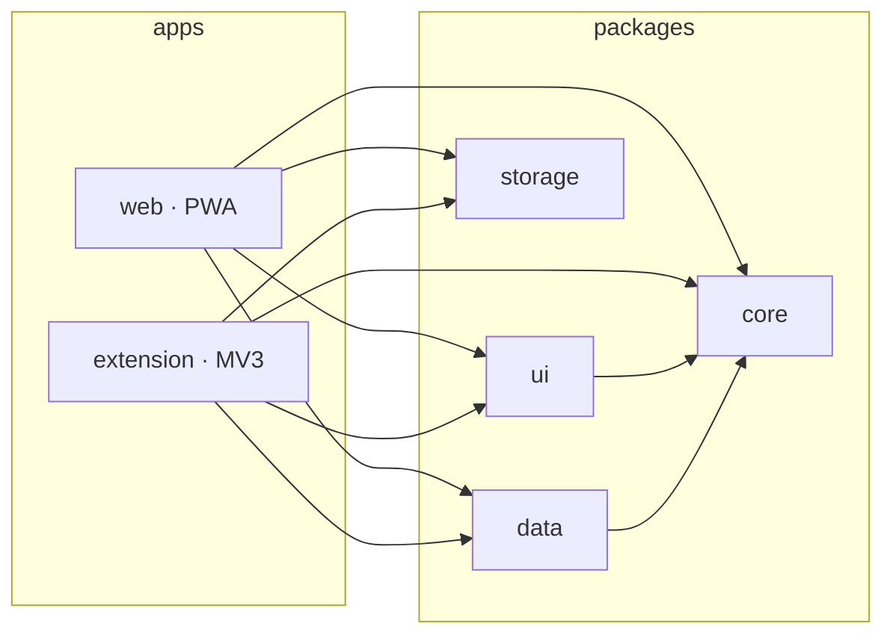

<p align="center">
  
</p>

<h1 align="center">Manarah (منارة)</h1>
<p align="center"><em>Lighthouse / minaret — the tower a light or a call is sent out from.</em></p>

<p align="center">
  Prayer times · Azkar &amp; dua reminders · Quran (text, audio, tafsir) · Radio · Qibla<br>
  One codebase → Chrome extension, web app (PWA), desktop &amp; mobile (planned)
</p>

<p align="center">
  <a href="https://github.com/AhmedNassar7/manarah/actions/workflows/ci.yml"></a>
  <a href="https://github.com/AhmedNassar7/manarah/actions/workflows/deploy-web.yml"></a>
  = 20">
  
</p>

## Why

- **Zero infrastructure** — static hosting, free public APIs, on-device storage. No server, no database.
- **One codebase, many shells** — logic in `packages/`, each app in `apps/` is a thin shell.
- **Offline-first** — PWA with a precaching service worker.

## Architecture



| Package/App     | Role                                                          |
| ---------------- | --------------------------------------------------------------- |
| `apps/web`       | React + Vite PWA, deployed to GitHub Pages                    |
| `apps/extension` | MV3 Chrome extension (Vite + CRXJS)                            |
| `packages/core`  | Prayer times, Qibla, azkar engine, Hijri calendar             |
| `packages/ui`    | Shared React components + design system                       |
| `packages/storage`| IndexedDB (Dexie) and `chrome.storage.sync` adapters          |
| `packages/data`  | Bundled static data — calculation methods, cities, azkar       |

Desktop (Tauri) and mobile (Capacitor) are planned, not started.

## Tech stack

TypeScript (strict) · React 18 · Vite · Dexie · Vitest + Testing Library · pnpm workspaces · ESLint

## Prerequisites

- [Node.js](https://nodejs.org/) 20 or later
- [pnpm](https://pnpm.io/) 9 or later

## Getting started

```bash
pnpm install

pnpm dev:web         # web app at http://localhost:5173
pnpm dev:extension   # builds to apps/extension/dist — load unpacked in chrome://extensions
```

## Scripts

| Script                | Runs                              |
| ---------------------- | ------------------------------------ |
| `pnpm dev:web`          | Web app dev server                  |
| `pnpm dev:extension`    | Extension in watch mode              |
| `pnpm build:web`        | Typecheck + build web app            |
| `pnpm build:extension`  | Typecheck + build extension          |
| `pnpm typecheck`        | Typecheck all packages               |
| `pnpm lint`             | Lint all packages                    |
| `pnpm -r test`          | Test all packages                    |

## Design system

Shared theme in [`packages/ui/src/styles.css`](packages/ui/src/styles.css) — one stylesheet for web, extension popup, and new-tab. Light/dark via `prefers-color-scheme`.

<p>
  
  
  
  
  
</p>

**Motion** — two easings (`--ease-spring` tactile, `--ease-quiet` calm), three durations (`--dur-tap` 180ms, `--dur-bloom` 550ms, `--dur-needle` 500ms), all collapsed under `prefers-reduced-motion`. Named animations: Qibla compass ripple, azkar completion bloom/tap, verse-of-the-day reveal. Plain CSS, no animation library.

## Deployment

| Workflow                                  | Trigger                          | Does                                  |
| ------------------------------------------- | ----------------------------------- | ---------------------------------------- |
| [`ci.yml`](.github/workflows/ci.yml)         | push / PR                          | install, typecheck, test, build both apps |
| [`deploy-web.yml`](.github/workflows/deploy-web.yml) | push to `main` (web/packages) | build `apps/web` → GitHub Pages        |

Live: **https://ahmednassar7.github.io/manarah/**

## Contributing

Early stage, breaking changes expected. Issues and PRs welcome.
